# Inowio Modbus Workbench

[](https://github.com/inowio/modbus-workbench/releases/latest)
[](https://github.com/inowio/modbus-workbench/actions/workflows/release.yml)
[](LICENSE)

Desktop toolkit for configuring, testing, and monitoring Modbus TCP/RTU devices. Built with Tauri, React, and TypeScript for a lightweight, cross-platform experience.


## Screenshots

| | |
| --- | --- |
| 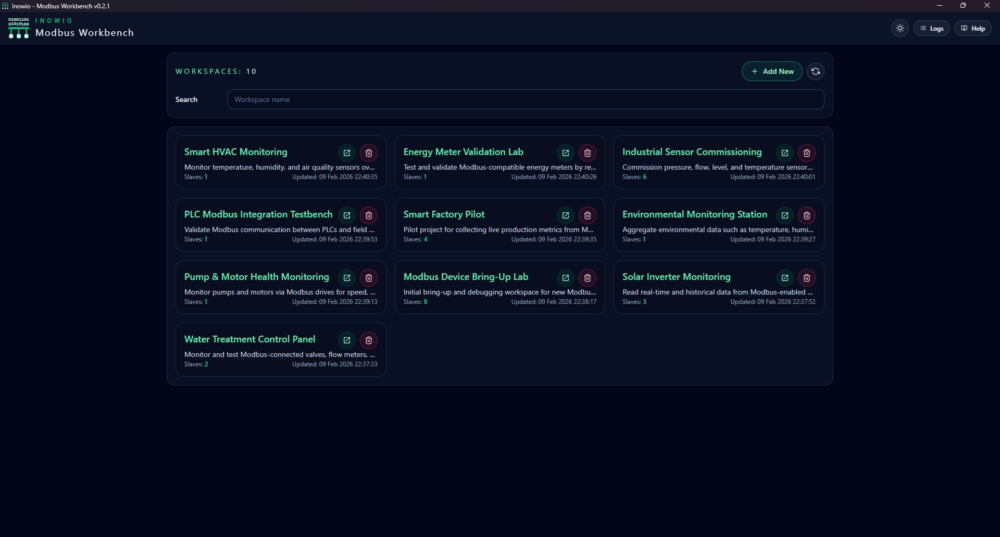 | 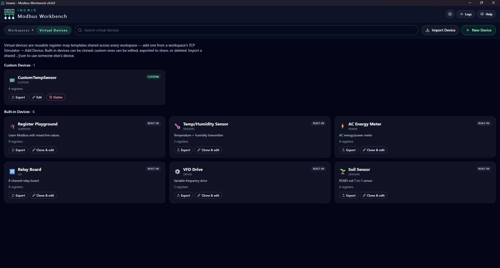 |
| 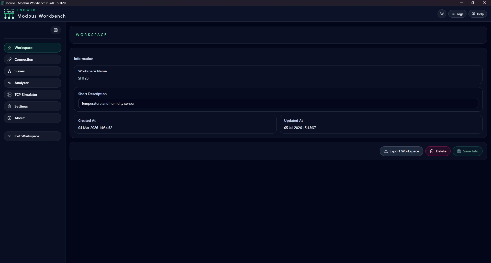 | 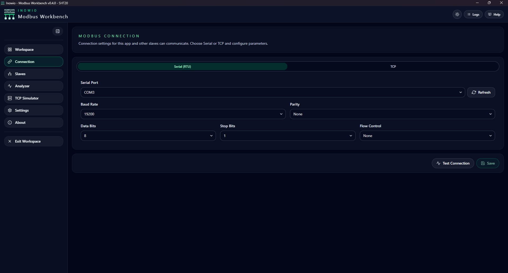 |
| 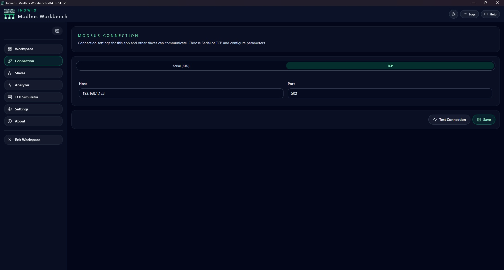 | 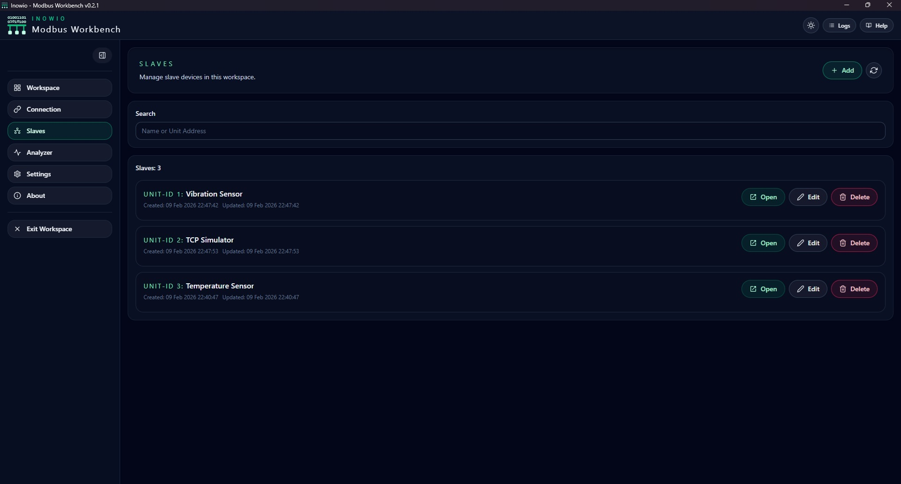 |
| 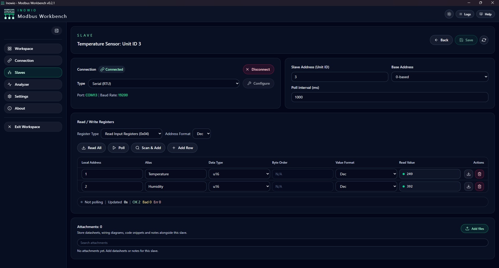 | 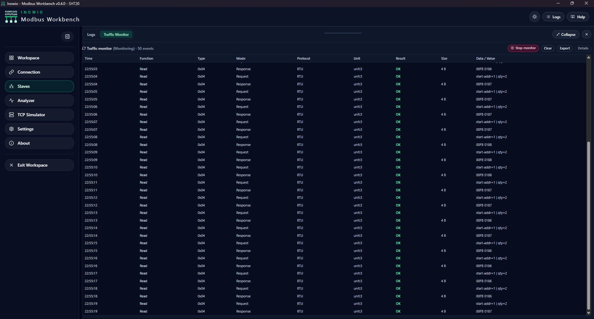 |
| 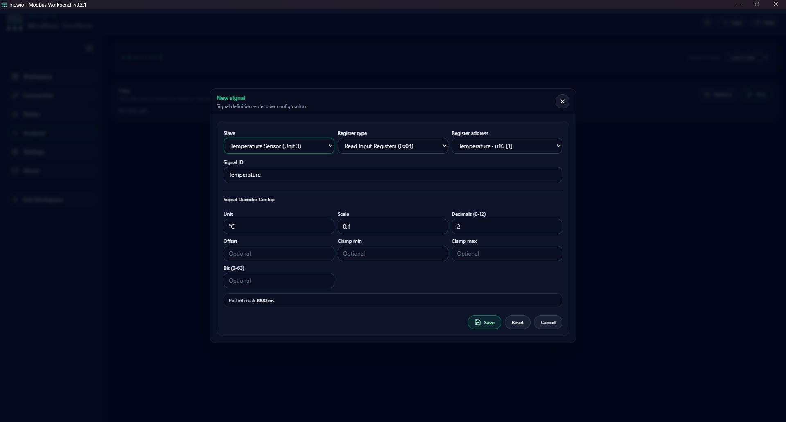 | 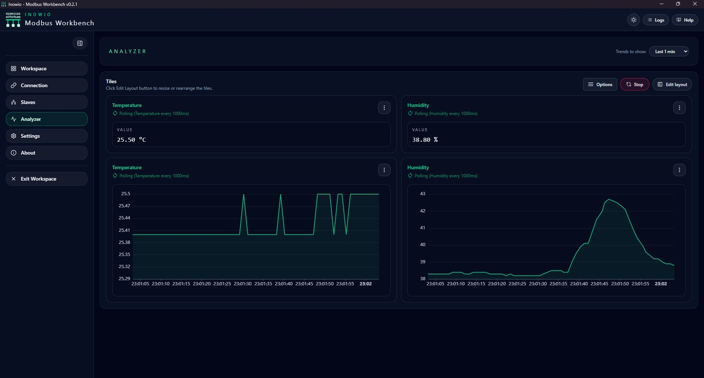 |
| 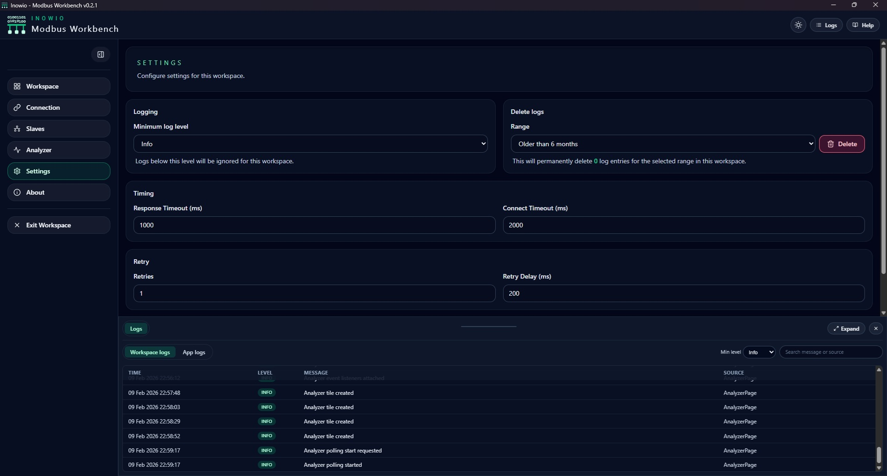 | 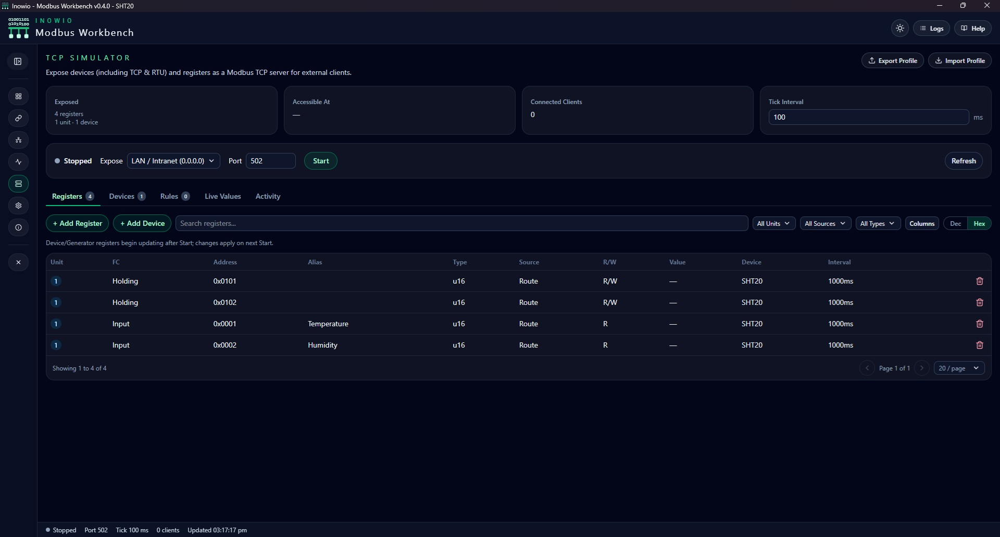 |
| 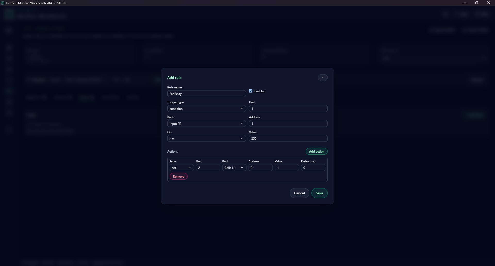 | 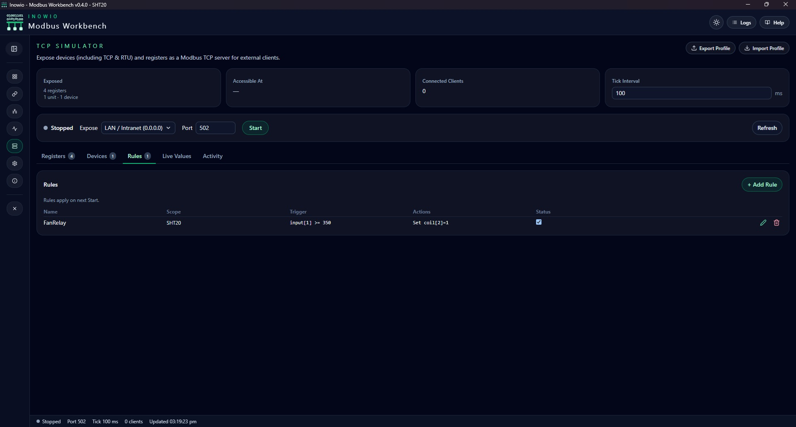 |
| 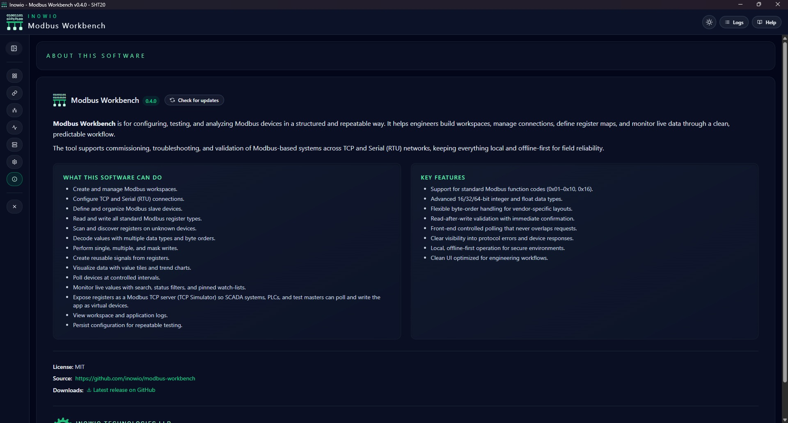 | 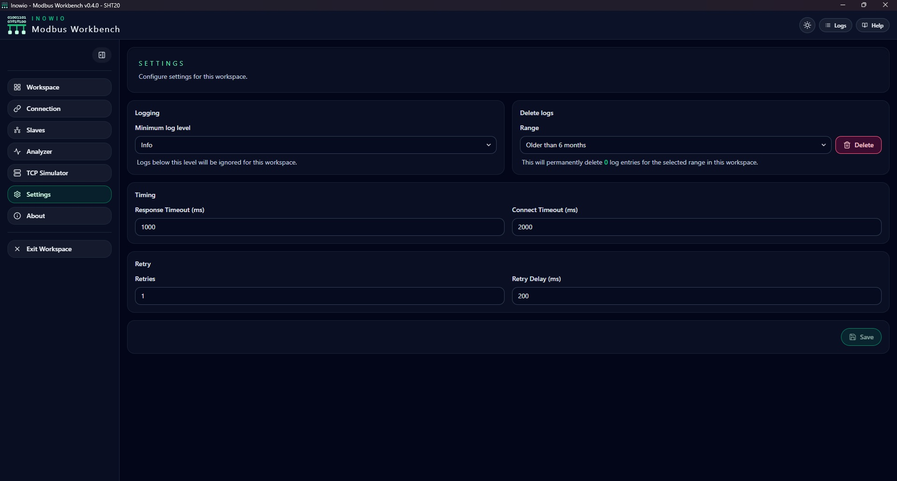 |

## Highlights

- Multi-protocol Modbus (TCP & RTU) with persistent workspace settings
- Device registry with register mapping, bulk import/export, and diagnostics
- Live register **Monitor** view with density, search, status filters, and pinned watch-lists for large maps
- **TCP Simulator (server mode)** — run a Modbus TCP server that answers external masters (SCADA/PLCs/test tools) across all four register banks (Coils, Discrete Inputs, Holding, Input) and multiple Unit IDs. Values can be fixed, generated (sine/ramp/decrement/step/random/toggle), or **routed from a real slave** (turning the app into a Modbus gateway with scale/offset). Tabbed workspace (Registers, Devices, Rules, Live Values, Activity), automation rules (trigger → action with delays), a clients/events Activity view, and workspace **Profile export/import**
- **Virtual Devices** — build a device's register map once and reuse it in any workspace's simulator via *Add Device*. A built-in catalog plus fully editable custom devices, a searchable icon picker, form-or-JSON parameters, **save-as** from a live device, one-click **expose a real slave as a routed device**, and **export/import as JSON** for community sharing
- Real-time analyzer powered by ECharts plus traffic capture for debugging
- Grid/list workspace browser that remembers your view, and per-slave register-type recall
- Rich logging, dark/light theming, and keyboard-friendly UI
- Ships as a native desktop app for Windows, macOS, and Linux
- In-app auto-updater with a manual "Check for updates" button on the About page

## Install

Pre-built installers for every release live on the
**[Releases page](https://github.com/inowio/modbus-workbench/releases/latest)**.
Pick the right one for your OS:

| OS      | Recommended installer | Auto-update | Notes                                    |
| ------- | --------------------- | ----------- | ---------------------------------------- |
| Windows | `*-setup.exe` (NSIS)  | Yes         | Use this for personal/desktop installs.  |
| Windows | `*.msi`               | No          | Manual re-install only; for MDM/IT use.  |
| macOS   | `*.dmg`               | Yes         | Universal binary (Intel + Apple Silicon).|
| Linux   | `*.AppImage`          | Yes         | Mark executable, then run.               |
| Linux   | `*.deb` / `*.rpm`     | No          | Manual re-install only.                  |

> **First-launch warning.** The binary is currently unsigned at the OS level,
> so the first time you run it Windows SmartScreen will show "Windows
> protected your PC" — click **More info → Run anyway**. macOS Gatekeeper
> will say the app cannot be opened — right-click the app and choose
> **Open**, then confirm. After this one-time approval, auto-updates inherit
> the trust and install silently.

### How updates work

Every release after the auto-update feature shipped checks
`https://github.com/inowio/modbus-workbench/releases/latest` on startup. If a
newer version exists, the app prompts you to install — you can also trigger
the check manually from the **About** page. Updates are minisign-signed by
the updater key, so a tampered download is rejected.

## Getting Started

### Requirements

- Node.js 18+
- Rust (stable) + target-specific build tools (VS Build Tools on Windows, Xcode CLT on macOS, `build-essential` on Linux)

### Quick Start

```bash
git clone https://github.com/inowio/modbus-workbench.git
cd modbus-workbench
npm install
npm run tauri dev
```

### Production Build

```bash
npm run tauri build
# Bundles land in src-tauri/target/release/bundle
```

## Development

```bash
npm run dev         # Vite frontend only
npm run tauri dev   # Full-stack dev (frontend + Rust)
npm run build       # Production frontend
npm run lint        # Frontend linting
npm run fmt         # Format Rust sources
```

## Unit Testing

```bash
npm run test:run
cd src-tauri
cargo test
```

Configuration tips:

- Dev server defaults: `VITE_DEV_SERVER_HOST=127.0.0.1`, `VITE_DEV_SERVER_PORT=1422`
- Bundled identifier: `TAURI_BUNDLE_IDENTIFIER=in.inowio.modbus.workbench`
- App data lives under the OS config directory (e.g., `%APPDATA%/in.inowio.modbus.workbench/` on Windows)

## Project Structure

```
cd modbus-workbench/
├── src/            # React + TypeScript UI
├── src-tauri/      # Rust backend, Tauri config, icons
├── public/         # Static assets & screenshots
└── docs/           # Extended documentation & help content
```

## Troubleshooting

- **Connection issues** – confirm TCP reachability or serial permissions, then retry.
- **Slow polling** – lower polling frequency or close unused workspaces.
- **Build failures** – reinstall dependencies (`npm ci`), update Rust toolchain, and ensure platform build tools are present.
- **Debug logging** – run `RUST_LOG=debug npm run tauri dev` to surface backend traces.

## Contributing

Please read [CONTRIBUTING.md](CONTRIBUTING.md) before opening an issue or pull request. Conventional commits, automated tests, and linted code help us triage quickly.

Maintainers cutting a release: see [docs/RELEASING.md](docs/RELEASING.md).

## License

Released under the [MIT License](LICENSE).

## Support & Contact

- Issues: <https://github.com/inowio/modbus-workbench/issues>
- Discussions: <https://github.com/inowio/modbus-workbench/discussions>
- Email: <info@inowio.in>

---

**Inowio Technologies LLP** 
– From Bits to Machines. 
[https://inowio.in](https://inowio.in)
